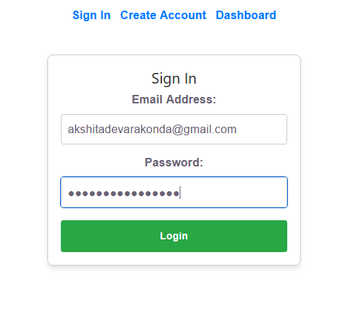
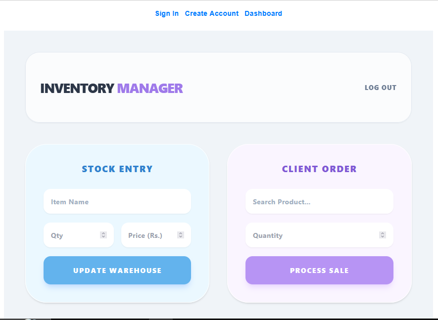
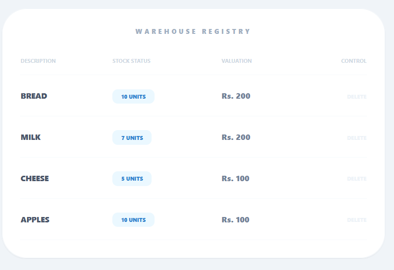
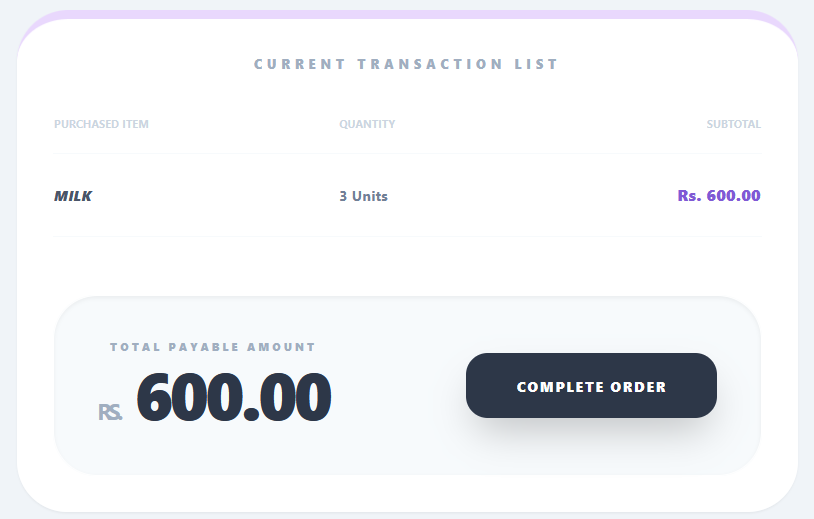

# TITLE- Inventory Manager

A full-stack MERN application designed for efficient inventory and transaction management in retail environments. The system provides real-time stock tracking, billing functionality, secure authentication, and a responsive dashboard interface for streamlined warehouse operations.

---

## 2. Features

###  Inventory Management
- Add new products to inventory
- Update product details and stock quantity
- Delete products from inventory
- Real-time inventory tracking
- Search and filter products

###  Billing & Transactions
- Dynamic order creation system
- Automatic subtotal and grand total calculation
- Real-time stock decrement after transactions
- Client order management
- Transaction summary panel

###  Authentication & Security
- JWT-based authentication
- Secure login system
- Password hashing using bcryptjs
- Protected routes and API endpoints

###  User Interface
- Modern dashboard UI
- Responsive layout for multiple screen sizes
- Spacious data tables for better readability
- Clean and minimal Tailwind CSS design


# Tech Stack

## Frontend
- React.js
- Tailwind CSS
- Axios
- React Hooks (`useState`, `useEffect`)
- React Router DOM

## Backend
- Node.js
- Express.js

## Database
- MongoDB 

## Authentication & Security
- JSON Web Token (JWT)
- bcryptjs
- dotenv
- cors

---

# Screenshots
## Login page


## Dashboard


## Warehouse Registry


## Transaction Panel


---

#  Live Demo

## Frontend
https://your-frontend-link.vercel.app

## Backend API
https://your-backend-link.onrender.com

---

#  Project Structure

inventory-manager/
│
├── client/                     # React Frontend
│   ├── src/
│   │   ├── components/
│   │   ├── pages/
│   │   ├── App.js
│   │   └── main.jsx
│   │
│   └── package.json
│
├── server/                     # Express Backend
│   ├── config/
│   ├── controllers/
│   ├── middleware/
│   ├── models/
│   ├── routes/
│   ├── server.js
│   └── package.json
│
├── screenshots/
├── README.md
└── .gitignore

---

#  Frontend Setup

## Install Dependencies

```
cd client
npm create vite@latest -- --template react
npm install axios react-router-dom
```

## Run Frontend

```
npm start
```

Frontend runs on:
```
http://localhost:5173
```

---

# Backend Setup

## Install Dependencies

```
cd server
npm install mongoose express dotenv jsonwebtoken bcryptjs cors
```

## Run Backend

```
npm run dev
```

Backend runs on:
```txt
http://localhost:5000
```

---

#  Environment Variables

Create a `.env` file inside the `server` folder.

```env
PORT=5000
MONGO_URI=mongodb://127.0.0.1:27017/inventory_manager
JWT_SECRET=super_secret_key_12345
```

---

#  Core Functionalities

##  CRUD Operations
The application supports complete CRUD functionality:

| Operation | Description |
|-----------|-------------|
| Create | Add new products |
| Read | Fetch inventory data |
| Update | Modify stock and details |
| Delete | Remove products |

---

## REST API Integration

Frontend communicates with backend using Axios API calls.

Example:
```js
axios.get("/api/products")
```

---

##  Authentication Flow

### User Login Process

```txt
User Login
    ↓
Backend Validation
    ↓
JWT Token Generation
    ↓
Token Sent To Frontend
    ↓
Protected Access Granted
```

---

## Real-Time Inventory Logic

When a client places an order:
- Product quantity decreases automatically
- Transaction totals update dynamically
- Inventory data syncs with MongoDB

---

#  API Endpoints

## Authentication Routes

| Method | Endpoint | Description |
|--------|----------|-------------|
| POST | /api/auth/register | Register user |
| POST | /api/auth/login | Login user |

---

## Product Routes

| Method | Endpoint | Description |
|--------|----------|-------------|
| GET | /api/products | Fetch all products |
| POST | /api/products | Add product |
| PUT | /api/products/:id | Update product |
| DELETE | /api/products/:id | Delete product |

---

#  Database Schema

## Product Schema

```js
{
  productName: String,
  quantity: Number,
  price: Number,
  category: String,
  createdAt: Date
}
```

---

## User Schema

```js
{
  name: String,
  email: String,
  password: String
}
```

---

#  Concepts Implemented

- MERN Stack Development
- RESTful APIs
- JWT Authentication
- Password Hashing
- MongoDB CRUD Operations
- Middleware
- State Management
- Component-Based Architecture
- Frontend-Backend Integration
- Responsive UI Design

---

#  Challenges Faced

- Managing frontend-backend integration
- Handling asynchronous API calls
- Maintaining real-time inventory updates
- Implementing secure authentication flow
- Designing responsive dashboard layouts

---

#  Future Improvements

- Role-based access control
- Product image uploads
- Sales analytics dashboard
- Export reports as PDF
- Email invoice generation
- Barcode scanning support
- Processing Transactions
- Pagination and advanced filtering

---

#  Testing

The project was tested for:
- CRUD functionality
- Authentication flow
- Inventory updates
- API response handling
- Responsive UI behavior

---

#  Deployment

## Frontend Deployment
- Vercel

## Backend Deployment
- Render

## Database Hosting
- MongoDB Atlas

---

#  Author

## Akshita Devarakonda

Full-Stack Developer | MERN Stack Enthusiast

GitHub: https://github.com/DevarakondaAkshita

LinkedIn: https://www.linkedin.com/in/devarakonda-akshita-909ab52b9/

---

#  Conclusion

This project demonstrates practical implementation of the MERN stack by combining secure authentication, real-time inventory logic, REST APIs, and responsive dashboard design into a complete retail management solution.